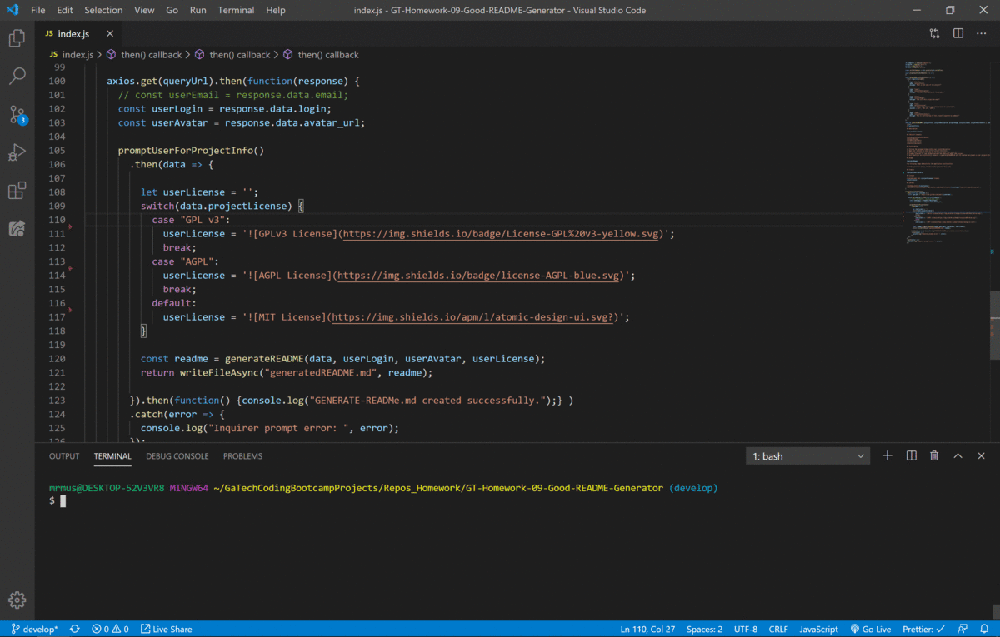

# GT-Homework-09-Good-README-Generator

Homework assignment, due 3/26/2020. Create a command-line application that dynamically generates a README.md from a user's input. The application will be invoked with the following command:

```sh
node index.js
```

## Description

The user will be prompted for their GitHub username, which will be used to make a call to the GitHub API to retrieve their email and profile image. They will then be prompted with questions about their project.

The README will be populated with the following:

* At least one badge
* Project title
* Description
* Table of Contents
* Installation
* Usage
* Contributing
* License
* Questions
  * User GitHub profile picture

## Table of Contents

*[Installation](#installation)
*[Usage](#usage)
*[Site](#site)
*[Repository](#repository)
*[Questions](#questions)
*[License](#license)

## Installation

1. Include the package folder within your project directory.
2. Open your terminal to your current project directory.
3. Within your project directory, in the console type 'node index.js'
4. Prompts with ask for your GitHub username and questions about your project.
5. Once questions are successfully answered, a generated README.md will be created and placed in your projects  directory.

## Usage

This project is fast for creating project READMEs. Useful for any project README creation.

The following image demonstrates the application functionality:



### Site

https://alanashworth.github.io/GT-Homework-09-Good-README-Generator/

### Repository

https://github.com/AlanAshworth/GT-Homework-09-Good-README-Generator

## Questions


## License

© 2019 Trilogy Education Services, a 2U, Inc. brand. All Rights Reserved.